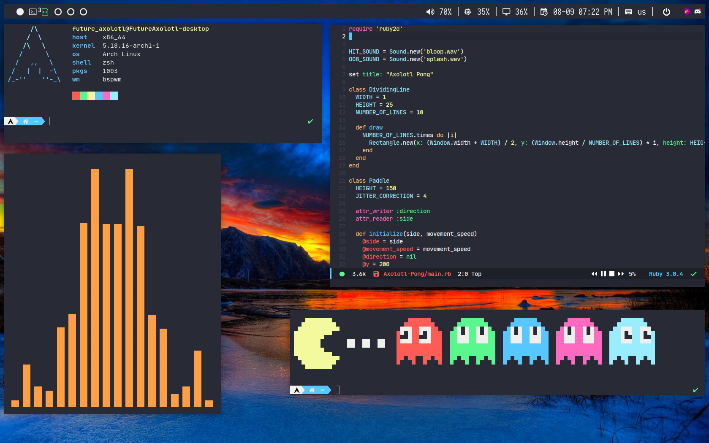

# snazzy-dotfiles
Thanks to [CordlessCoder](https://github.com/CordlessCoder) for the [polywins Polybar module](https://github.com/CordlessCoder/polywins.py)!

NOTE: Dotfiles may consistently update.



# Dependencies
You need to have:

* Iosevka Nerd Font
* JetBrainsMono Nerd Font
* Knack Nerd Font
* ZSH
* [Oh My ZSH](https://ohmyz.sh/)
* [Powerlevel10k installed through Oh My ZSH](https://github.com/romkatv/powerlevel10k)
* Dunst
* Picom
* BSPWM & SXHKD
* Playerctl
* Alacritty
* Emacs with [Doom Emacs](https://github.com/doomemacs/doomemacs) installed
* Treemacs Emacs package installed for a sidebar that shows files
* Tremacs-All-The-Icons Emacs package installed for the icons in Treemacs
* Vterm Emacs package installed for an Emacs terminal emulator
* Bongo Emacs package installed with some of its backends if you want a music player in Emacs (optional)
* Polybar
* Pfetch
* Feh
* Rofi
* Discord with [BetterDiscord](https://github.com/BetterDiscord/BetterDiscord) installed
* xorg-xprop
* xdo
* wmctrl
* slop
# Installation

``` sh
git clone https://github.com/FutureAxolotl/snazzy-dotfiles.git && cd snazzy-dotfiles && ./install.sh
```
You will have to change DVI-0 in line 300 of the Polybar config to whatever the monitor input is (run xrandr if you don't know what input it is). For information about multi-monitor support, refer to the [Polywins.py GitHub page](https://github.com/CordlessCoder/polywins.py).
